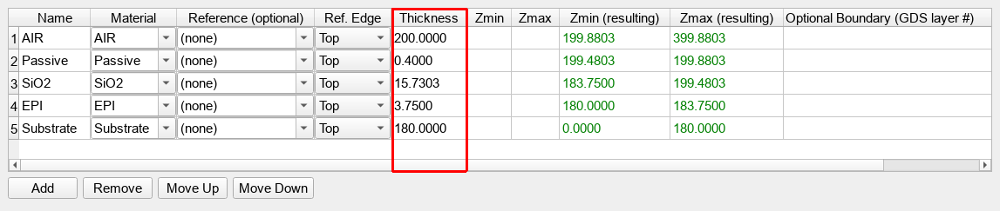
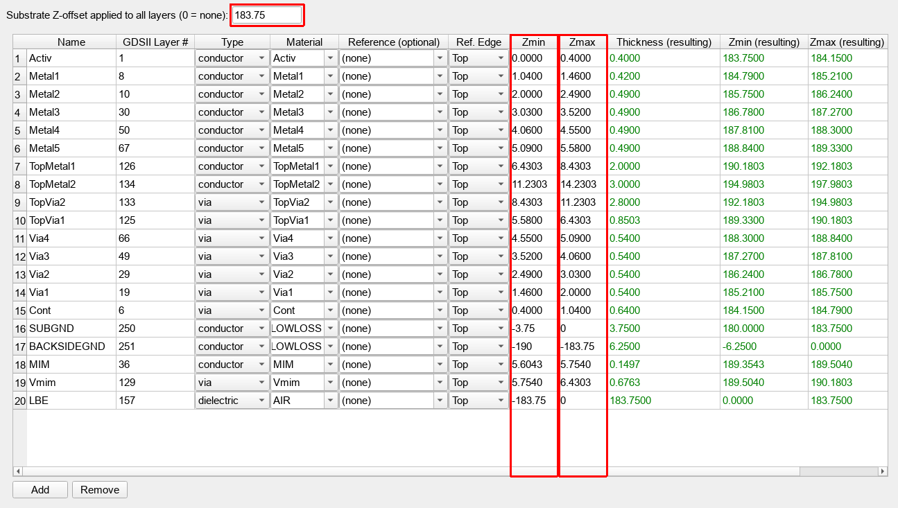
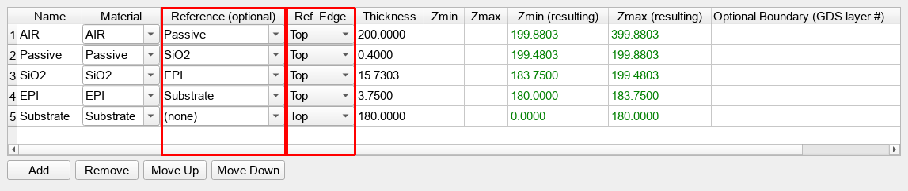
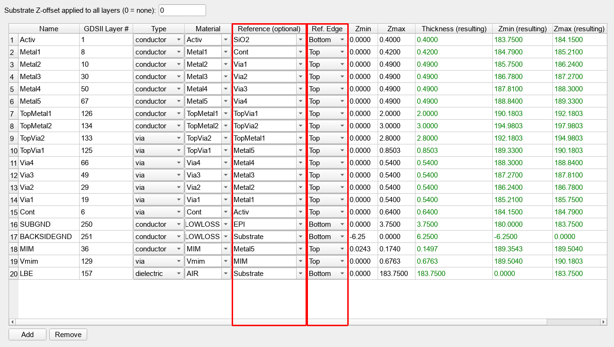
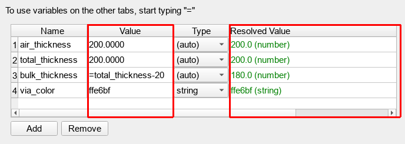
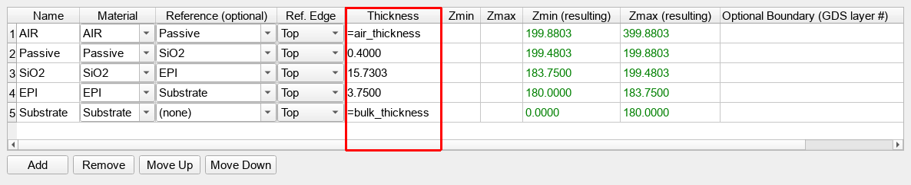
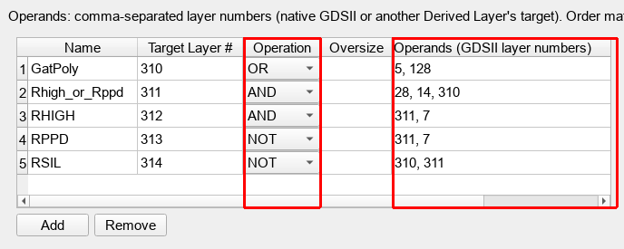
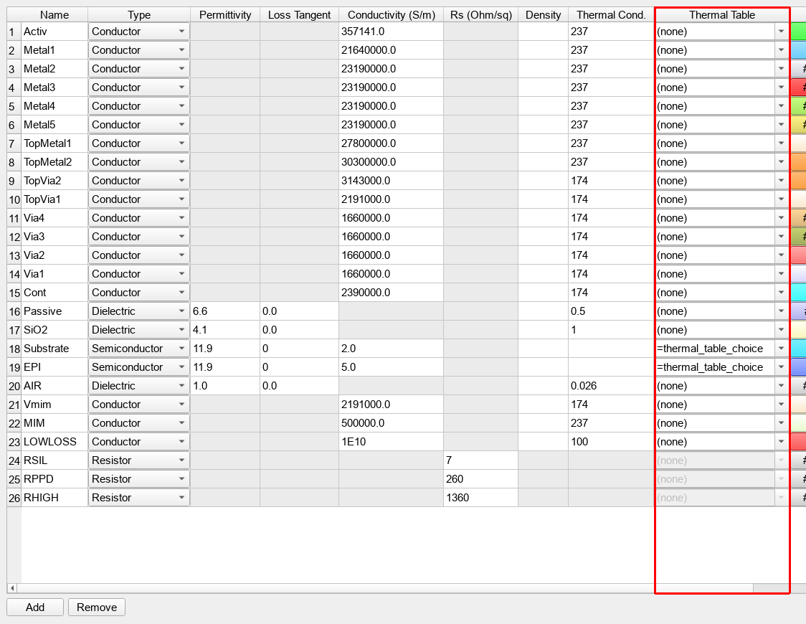
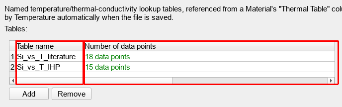
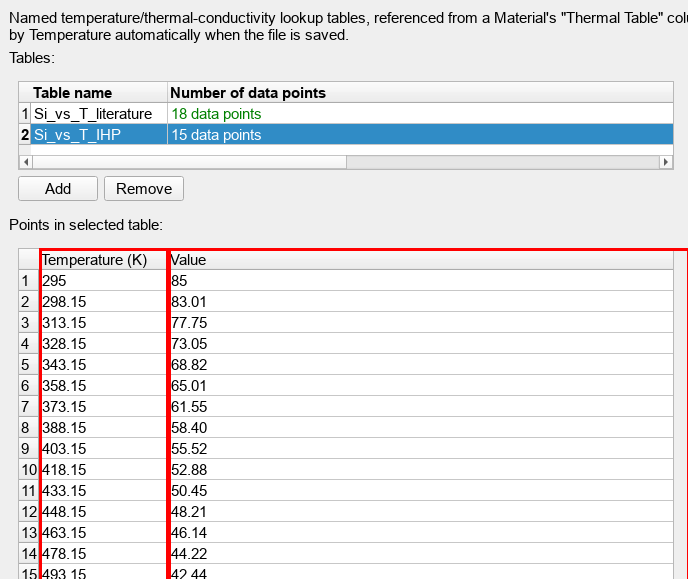

# Evolution of the Stackup File Format

Volker Mühlhaus, volker@muehlhaus.com

---
Document version: 2026-08-19

## Contents
[About this document](#about-this-document)  
[Generation 1: the legacy format (schemaVersion "2.0")](#generation-1-the-legacy-format-schemaversion-20)  
[Generation 2: Reference-relative positioning (schemaVersion "3.0")](#generation-2-reference-relative-positioning-schemaversion-30)  
[Generation 3: Variables and expressions (schemaVersion "3.1")](#generation-3-variables-and-expressions-schemaversion-31)  
[Also arriving with schemaVersion "3.0": Derived Layers](#also-arriving-with-schemaversion-30-derived-layers)  
[Beyond schemaVersion: Thermal Conductivity Tables](#beyond-schemaversion-thermal-conductivity-tables)  
[Trying it yourself](#trying-it-yourself)  

## About this document

The stackup XML format (materials, dielectric stack, drawn metal/via layers) has grown several
times since its original design, each time to remove a real limitation the previous format had.
This document walks through that growth generation by generation, using screenshots from the
**Stackup Editor** GUI (part of [setupEM](https://github.com/VolkerMuehlhaus/setupEM)) to show
exactly which fields on which tab were added at each step, why the previous generation fell
short, and how the new fields solve it. Every field discussed is outlined in **red** in its
screenshot.

This is a narrative companion to [`XML_stackup_format.md`](XML_stackup_format.md), which is the
complete, authoritative attribute reference — use that document to look up an attribute's exact
rules; use this one to understand why the format looks the way it does and where to find each
piece in the editor.

Every screenshot in this document was taken from one of the four example files in
[`../../more_examples/XML_stackup_format_examples/`](../../more_examples/XML_stackup_format_examples/),
which walk through the same generations as real, loadable XML files (`01_...` through `04_...`,
plus a `README.md` covering the same ground from the XML side rather than the GUI side). Open any
of them yourself in the Stackup Editor to follow along.

## Generation 1: the legacy format (schemaVersion "2.0")

The original format positions everything two ways. A `<Dielectric>` has no position field at
all — dielectrics are read top-to-bottom in file order, and each one's `Thickness` simply stacks
it on top of the one below:

A `<Layer>`, on the other hand, needs an absolute `Zmin`/`Zmax` — a real coordinate, not a
thickness — and since the drawn metal stack usually needs to sit on top of the dielectric stack
computed above, a single `<Substrate Offset="...">` value shifts every Layer's `Zmin`/`Zmax` up
by a fixed amount to land in the right place:

### Shortcomings

This works, but it is fragile in two specific ways once a stackup needs to change:

- **Every absolute `Zmin`/`Zmax` must be hand-recomputed** whenever anything below it changes.
  Increase `SiO2`'s `Thickness` by 2 µm in the Dielectrics tab above, and every single `Zmin`/
  `Zmax` pair in the Layers tab that sits above `SiO2` — which, in this stackup, is nearly all of
  them — is now wrong until you manually add 2 to each one.
- **`Substrate Offset` is one global fudge factor.** It has to account for the exact combined
  thickness of every dielectric between the Layers' own local origin and wherever the substrate
  actually sits — one number standing in for a calculation that exists nowhere in the file. If
  that calculation was ever done on paper and the dielectric stack changes later, there is no way
  to tell from the file itself that `Offset` is now stale.

Both problems have the same root cause: a value's *position* is stored as an absolute number,
with the dependency on everything below it existing only in whoever's head computed that number —
not in the file.

## Generation 2: Reference-relative positioning (schemaVersion "3.0")

The fix is to let a Dielectric or Layer name what it is positioned *against*, instead of storing
an absolute coordinate. Two new columns, **Reference** and **Ref. Edge**, appear on both the
Dielectrics and Layers tabs:

`Reference` names another Dielectric (for a `<Dielectric>`) or another Dielectric/Layer (for a
`<Layer>`); `Ref. Edge` says whether that's measured from the reference's top or bottom edge.
`Zmin`/`Zmax` (or `Thickness`, for a Dielectric) are then just small offsets from that edge,
instead of absolute coordinates — most of the time literally `0` and the element's own thickness.
The same mechanism replaces `Substrate Offset` on the Layers tab: instead of one global shift,
`LBE`/`BACKSIDEGND` here reference the `Substrate` dielectric's own bottom edge directly.

Notice the two green **"(resulting)"** columns on the right of both tabs — `Zmin (resulting)`/
`Zmax (resulting)` on Dielectrics, the same pair on Layers. These are read-only, computed live by
the editor from whatever `Reference` chain is currently in effect, so you can always see the
actual absolute position a Reference-based element resolves to, without doing the arithmetic
yourself. Change `SiO2`'s `Thickness` now, and every Layer that references it (directly or
through a chain of other references) updates its own resolved position automatically — the
exact hand-recomputation problem from Generation 1 is gone.

### Remaining shortcoming

Reference-relative positioning solves *where* something sits relative to its neighbor, but every
number still has to be typed in as a literal, everywhere it's needed. The same conductivity value
is repeated on `TopMetal1` and `TopVia1`'s `<Material>` entries because they happen to share a
value in this particular technology; a chip's total height is baked separately into the `AIR`
dielectric's thickness *and* the substrate's thickness *and* (in the legacy format) into
`Substrate Offset`. There is still no single place to change a value once and have every use of
it follow — and no way to tell, just from reading the file, that two identical-looking numbers
in different places are supposed to stay identical.

## Generation 3: Variables and expressions (schemaVersion "3.1")

The next generation adds a dedicated **Variables** tab, appearing first (before Materials) in
the tab order:

A `<Variable>` has a `Name`, a `Value`, and an optional `Type`. The **Value** column is where the
actual value or formula goes — either a plain literal (`200.0000`, `ffe6bf`), or, once you start
typing `=`, a small arithmetic expression that can reference other variables by name
(`=total_thickness-20`). The **Resolved Value** column, like the "(resulting)" columns on the
Dielectrics/Layers tabs, is read-only and computed live — it shows what a `=`-expression
*actually* evaluates to right now, and its type (`number`/`string`), so a typo or a circular
reference is obvious immediately instead of only failing later at Save.

The real payoff, though, is that this `=` syntax works in **any** attribute value anywhere else
in the file — not just inside `<Variables>`. Here is the same Dielectrics tab from Generation 2,
now using expressions in its `Thickness` column instead of hardcoded literals:

`AIR`'s thickness is `=air_thickness`; `Substrate`'s is `=bulk_thickness`, itself defined on the
Variables tab as `=total_thickness-20`. Change `total_thickness` once, on the Variables tab, and
both the substrate's thickness and everything computed from it (its own resolved Zmin/Zmax, and
any Layer referencing it) follow — the "one source of truth" problem from the end of Generation 2
is solved the same way the positioning problem was solved in Generation 2 itself: by replacing a
copied literal with a named reference to where the value actually lives.

## Also arriving with schemaVersion "3.0": Derived Layers

Reference-relative positioning was not the only feature that bumped the format to
`schemaVersion="3.0"` — a completely independent feature, **Derived Layers**, arrived at the
same schema version. Some GDSII layers used in a simulation don't exist as drawn geometry at
all — they need to be *computed* from other layers, e.g. an on-chip resistor recognized as
"poly AND implant AND NOT contact". The **Derived Layers** tab defines these as boolean
operations on other layer numbers:

**Operation** is one of `AND`/`OR`/`XOR`/`NOT`/`SIZE` (a pure resize); **Operands** lists the
native GDSII or other-derived-layer numbers it combines, comma-separated, in order (order matters
for `NOT`, which subtracts every operand after the first from the first). A file can use Derived
Layers, Reference-relative positioning, both, or neither — whichever of the two it actually uses
(if any) is what decides whether it needs `schemaVersion="3.0"`, same as `"3.1"` is decided by
whether `<Variables>`/expressions are used at all, independent of everything else in the file.
See [`derived_layers.md`](derived_layers.md) for the full operation reference, including
chaining derived layers off each other and how self-touching ("keyhole") results are handled
downstream.

## Beyond schemaVersion: Thermal Conductivity Tables

Every feature above this point bumps `schemaVersion` (`"2.0"` → `"3.0"` → `"3.1"`) the moment
it's used. Thermal conductivity tables are different: they're optional content that an older
reader simply doesn't need to know about to parse the rest of the file correctly, so they don't
require any particular `schemaVersion` on their own. This tab still rounds out what "full
featureset" means for this format (see
[`04_full_featureset_schemaVersion3.1.xml`](../../more_examples/XML_stackup_format_examples/04_full_featureset_schemaVersion3.1.xml),
which combines everything in this document — Reference, Variables, Derived Layers, and Thermal
Tables — into one file).

`ThermalConductivity`, `ThermalConductivityTable`, and `Density` are not used at all for EM
simulation — they only matter for a *thermal* simulation (the Elmer thermal flow), and even
there, `Density` is passed through to the Elmer solver but has no effect on a steady-state
thermal simulation specifically. A plain constant `ThermalConductivity` is often not good
enough for that thermal flow — silicon's thermal conductivity,
for example, drops by roughly a factor of two between 250 K and 450 K, and a temperature-dependent
lookup curve matters for an accurate result. Instead of a constant, a `<Material>`'s **Thermal
Table** column can reference a named temperature/conductivity table by name:

The dropdown lists every table declared on the new **Thermal Tables** tab — and, like the
Reference and Material dropdowns on other tabs, it also accepts a
`"=variable"` expression instead of a literal table name (`Substrate` and `EPI` both show
`=thermal_table_choice` here — a string Variable, so a script can switch both materials to a
different measured dataset by overriding one Variable, with no XML edit at all). Notice row 24
onward: the dropdown is grayed out and disabled for `Resistor`-type materials, since a
zero-thickness sheet resistor has no volume to conduct heat through in the first place.

The Thermal Tables tab itself is a master/detail view: the top grid lists every named `<Table>`,
with a computed **Number of data points** column so you can see each curve's size without
opening it:

Selecting a table shows its individual temperature/value points in the grid below:

Each `<Point>` has a **Temperature (K)** and a **Value** (conductivity, in W/(m·K)); like every
other numeric field in this format, either can itself be a `=`-expression. Points don't need to
be entered in temperature order — the editor sorts every table's points ascending by Temperature
automatically the moment the file is saved, since the downstream Elmer solver reads them as a
piecewise-linear lookup curve and needs them in order to interpolate correctly.

## Trying it yourself

The four example files in
[`../../more_examples/XML_stackup_format_examples/`](../../more_examples/XML_stackup_format_examples/)
correspond exactly to the generations in this document — `01_...` (schemaVersion `"2.0"`) through
`04_...` (schemaVersion `"3.1"`, full featureset) — and describe the same, physically identical
IHP SG13G2 stackup at every step, so the differences you see between them are only ever the
feature being introduced at that point. That folder's own `README.md` covers the same
progression from the raw XML side.

To open any of them in the Stackup Editor GUI shown throughout this document: from within
setupEM or setupThermal, use **Tools > Edit Stackup XML...**; or, standalone (no gds2palace
model/simulation setup involved), run `stackupEditor` from a terminal with the venv activated,
optionally with a filename: `stackupEditor 04_full_featureset_schemaVersion3.1.xml`.
