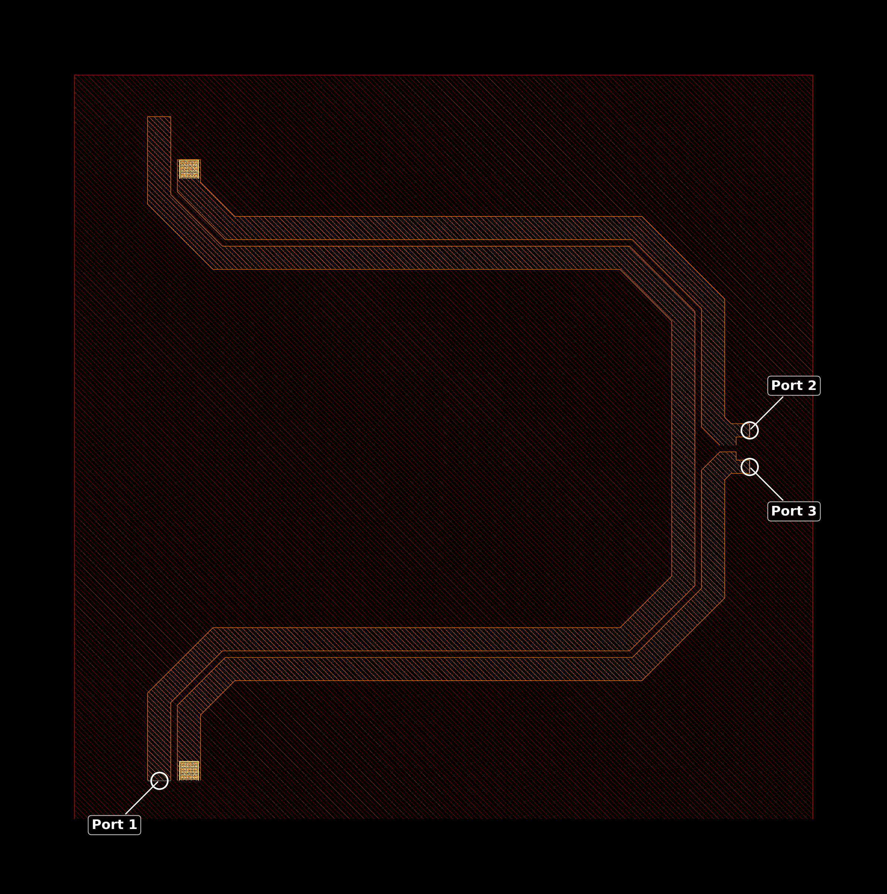
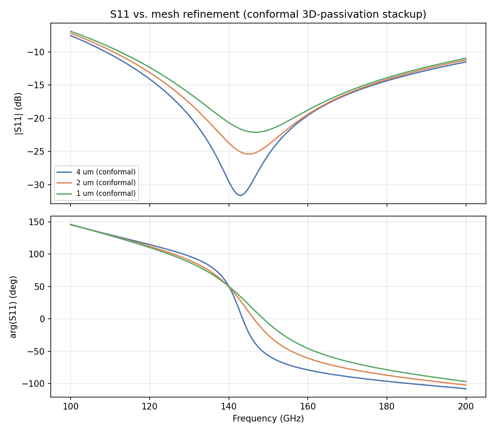
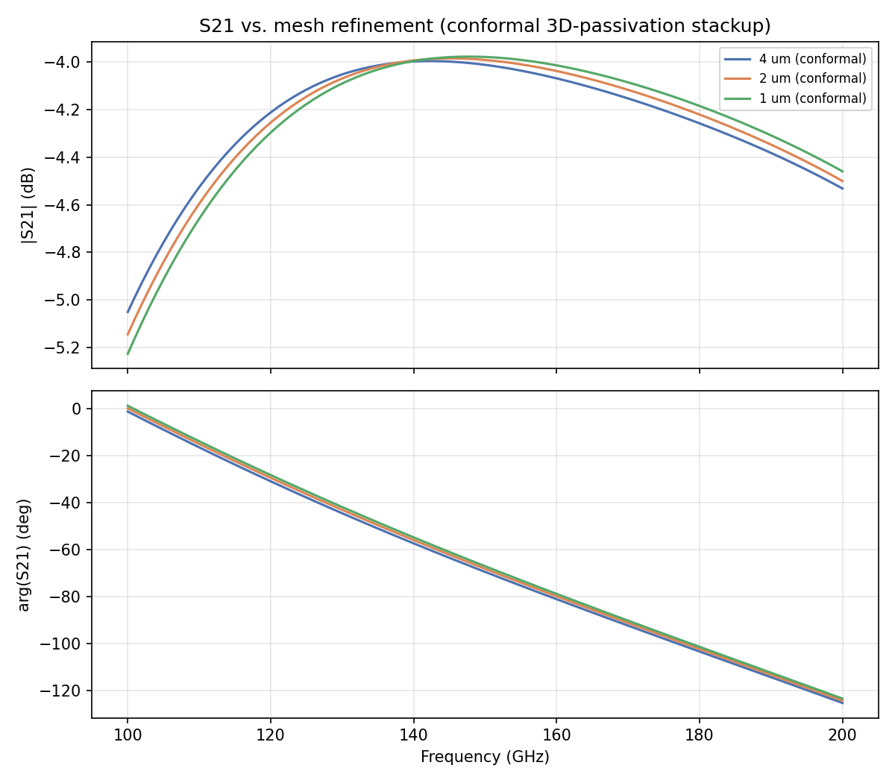
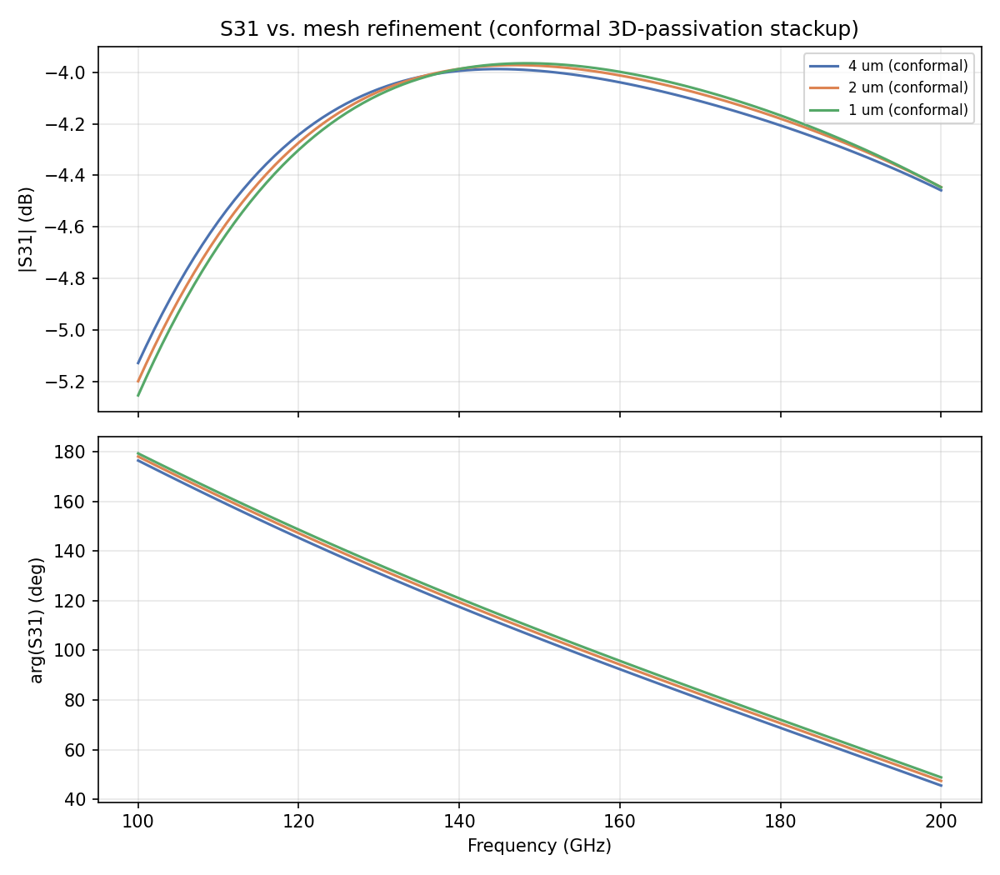
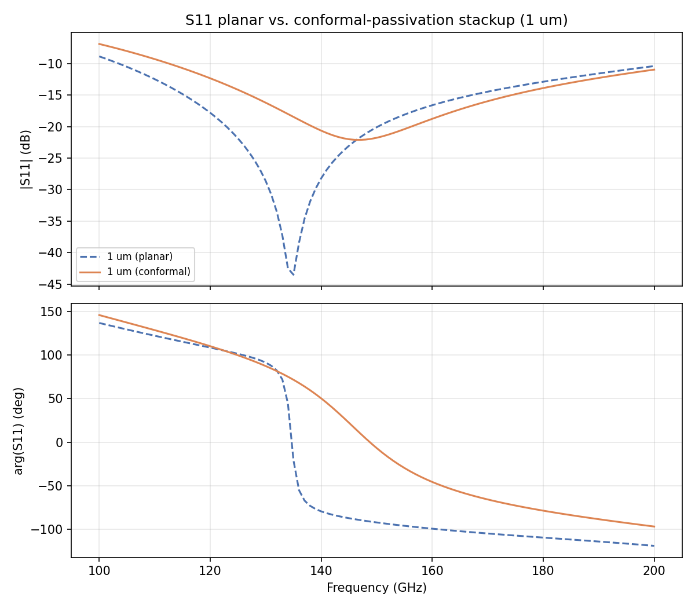
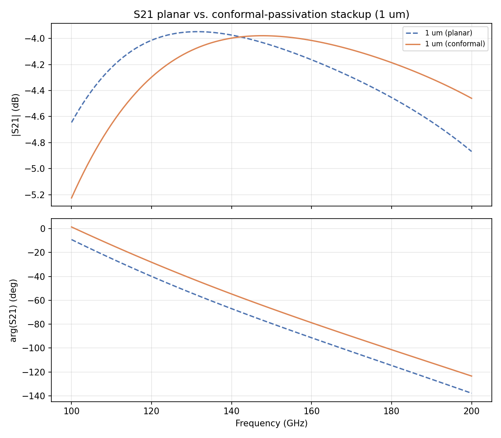

# Mesh Convergence Study: D-Band Balun, Conformal 3D-Passivation Stackup (IHP SG13G2)

- **Model:** `Balun_140-170G_RupokDas_with_ports.gds` — the identical layout used in the planar-stackup [`mesh_convergence_D-band_balun`](../mesh_convergence/mesh_convergence_D-band_balun/README.md) study, so any S-parameter difference between the two studies is attributable to the stackup alone, not the geometry.
- **Stackup:** `SG13G2_200um_3D_passivation.xml` — unlike the planar study's `SG13G2_nosub.xml` (TopMetal2 fully embedded under a flat, thick SiO2 + Passivation layer), this stackup adds narrow SiO2 blocks conforming to the metal step near TopMetal2, plus built-in local mesh refinement there — closer to physical reality for closely-spaced top-metal traces, and intended to help capture near-field coupling even at a coarser global `refined_cellsize`.
- **Solver:** AWS Palace (FEM), order 2, ABC boundaries, 50 µm air margin
- **Sweep:** 100–200 GHz, 1 GHz step, Palace's PROM-based adaptive frequency sweep
- **Ports:** 3 via ports (Metal3 → TopMetal2, Z0 = 50 Ω), de-embedded S-parameters used throughout (port parasitic inductance removed)
- **Execution:** remote solve on `hpz2` (Spack-built Palace, `mpirun -n 16` of 32 cores, 109 GB RAM), jobs run sequentially

## 0. Layout



Same GDS as the planar study: a folded edge-coupled line pair on TopMetal2/Metal3, ~182×201 µm bounding box inside a 223×225 µm cell. **Port 1** feeds the primary line; the coupled secondary line is brought out as **Port 2**/**Port 3**, ~11 µm apart. See the [planar study's §0](../mesh_convergence/mesh_convergence_D-band_balun/README.md#0-layout) for the full layout description.

## 1. Method

Three uniform-mesh runs, `refined_cellsize` = 4, 2, 1 µm, `adaptive_mesh_iterations=0`, `order=2`, `refined_cellsize_override=[['Metal3', 5.0]]` fixed as in the planar study. Model files: `palace_balun_mesh4.py`, `palace_balun_mesh2.py`, `palace_balun_mesh1.py`.

This is a narrower sweep than the planar study (which also covered 5/3 µm, AMR, and p-refinement) — the goal here isn't a from-scratch convergence characterization but a direct **stackup comparison at matched mesh sizes**: does the conformal stackup's own coarse mesh already capture what its fine mesh sees, and how far do its results sit from the planar stackup at each mesh point?

## 2. Uniform mesh sweep — results

| Mesh | DOF | Mesh elements | Solve time | Peak RAM | Error indicator (Norm / Max) |
|---|---:|---:|---:|---:|---|
| 4 µm | 287,732 | 42,532 | 3m 2s | 3.75 GB | 0.1988 / 8.64e-3 |
| 2 µm | 475,966 | 70,174 | 5m 53s | 6.00 GB | 0.1565 / 4.41e-3 |
| 1 µm | 847,248 | 122,949 | 9m 5s | 9.39 GB | 0.1174 / 2.81e-3 |

DOF/RAM run noticeably higher than the equivalent points in the planar study (e.g. 2 µm: 476k DOF / 6.0 GB here vs. 340k DOF / 4.2 GB planar) — the conformal stackup's built-in refinement blocks near TopMetal2 add mesh even before `refined_cellsize` bites. Error indicators drop monotonically with refinement, same trend as the planar study.

## 3. S-parameter overlays (within this study, 4/2/1 µm)





The curves converge as the mesh refines, same qualitative behavior as the planar study — but with a visibly *smaller* spread between the 2 µm and 1 µm curves than the planar study shows between its own 2 µm and 1 µm curves (quantified in §4).

## 4. Delta-S tables (within this study)

**Metric:** `Max|ΔS|` is the linear complex-magnitude difference `|S_b − S_a|` over the common frequency band (same convention as the planar study and `palace_summary.py`'s AMR metric) — not a dB(b)−dB(a) difference, which blows up near an S-parameter null. `|dS_dB|` columns are a secondary readout at the two band edges and 155 GHz (the 140–170 GHz target band's center).

### Successive mesh steps

| Comparison | Max\|ΔS\| (linear) | \|ΔS\|@100GHz (dB) | \|ΔS\|@155GHz (dB) | \|ΔS\|@200GHz (dB) |
|---|---:|---:|---:|---:|
| S11, 4→2 µm | 0.0335 | 0.366 | 0.427 | 0.295 |
| S11, 2→1 µm | 0.0304 | 0.289 | 1.153 | 0.250 |
| S21, 4→2 µm | 0.0161 | 0.094 | 0.026 | 0.032 |
| S21, 2→1 µm | 0.0131 | 0.082 | 0.019 | 0.040 |
| S31, 4→2 µm | 0.0212 | 0.071 | 0.024 | 0.013 |
| S31, 2→1 µm | 0.0165 | 0.055 | 0.012 | 0.001 |

Compare directly against the planar study's own successive-step table (§5a there): planar 2→1 µm is 0.0359 (S11) / 0.0187 (S21) / 0.0169 (S23) — **larger** than this study's 2→1 µm step (0.0304 / 0.0131 / 0.0165) on S11 and S21, and about equal on the third port pair. Even this study's *combined* 4→2 µm step (spanning two mesh sizes at once) stays below the planar study's single 3→2 µm step (0.0290 S11 / 0.0145 S21) on S21, and is close on S11. That supports the premise this test set out to check: **the conformal stackup's built-in SiO2 refinement blocks near TopMetal2 measurably reduce the mesh-size sensitivity** of the coupling-dependent S-parameters, compared to the planar stackup at the same nominal `refined_cellsize`.

Full table: [`delta_S_table.csv`](results/delta_S_table.csv). Every mesh vs. the finest (1 µm) reference: [`delta_S_vs_finest.csv`](results/delta_S_vs_finest.csv).

## 5. Conformal vs. planar stackup — the actual comparison




At matched mesh size (1 µm, each study's finest point here), the stackup change shifts the response substantially — far more than mesh refinement does within either study:

| Comparison (1 µm mesh) | Max\|ΔS\| (linear) | \|ΔS\|@100GHz (dB) | \|ΔS\|@155GHz (dB) | \|ΔS\|@200GHz (dB) |
|---|---:|---:|---:|---:|
| S11, planar → conformal | 0.1229 | 1.971 | 2.299 | 0.566 |
| S21, planar → conformal | 0.1487 | 0.580 | 0.113 | 0.409 |
| S31, planar → conformal | 0.1906 | 0.376 | 0.009 | 0.076 |

For reference, this study's own worst-case *mesh* sensitivity (4→1 µm, §4 extended) tops out at 0.0638 (S11) / 0.0292 (S21) / 0.0377 (S31) — the planar-vs-conformal shift is **2–5× larger** than the full coarse-to-fine mesh spread on every parameter, and holds at 2 µm and 4 µm too (see [`delta_S_vs_planar.csv`](results/delta_S_vs_planar.csv)). Concretely, visible in the plots:

- **S11 null moves and shallows**: planar shows a sharp −44 dB null near 135 GHz; conformal shows a much shallower −22 dB null shifted to ~147 GHz. The extra dielectric loading and conformal geometry near TopMetal2 changes the effective coupling enough to detune the balun's return-loss null by ~12 GHz and fill it in by over 20 dB.
- **S21 peak also shifts**: planar peaks (least loss) near 128 GHz; conformal peaks near 145 GHz, closer to the design band center (155 GHz) — plausibly a more physically realistic prediction if the conformal stackup is the better model of the real process cross-section.

This is the headline result of this test: **the choice of planar vs. conformal-passivation stackup dominates over mesh refinement** for this geometry — getting the stackup assumption right matters far more than pushing `refined_cellsize` below 2 µm.

## 6. Discussion / recommendation

- **2 µm looks like a good working point for the conformal stackup**, same conclusion as the planar study: it differs from the 1 µm result by only 0.013–0.030 linear ΔS (§4). Even 4 µm, at 0.029–0.064 linear ΔS vs. 1 µm (see [`delta_S_vs_finest.csv`](results/delta_S_vs_finest.csv)), is closer to its own finest-mesh result than the planar study's 4 µm point was to *its* finest mesh (0.044–0.087, planar §5b) — consistent with the side-SiO2 refinement blocks doing useful work even at a coarse global cell size.
- **Mesh refinement is not the dominant error source here.** The planar-vs-conformal stackup shift (§5) dwarfs the mesh-refinement spread (§4) on all three S-parameters. For this class of tightly-coupled top-metal geometry, correctly modeling whether the passivation is planar or conforms to the metal step matters more than chasing a finer mesh.
- **If the real process passivation conforms to the metal topography** (as it typically does for standard passivation deposition over non-planar structures), the conformal stackup's ~12 GHz null shift and ~20 dB null-depth change relative to the planar assumption is not a modeling artifact to mesh away — it's the physically expected result of using the more accurate stackup.

## 7. Where everything lives

```
more_examples/conformal_3D_passivation/
├── README.md                                  # this report
├── palace_balun_mesh4.py, mesh2.py, mesh1.py   # uniform mesh model scripts
├── Balun_140-170G_RupokDas_with_ports.gds
├── SG13G2_200um_3D_passivation.xml
├── palace_model/palace_balun_mesh{4,2,1}_data/  # generated mesh/config + full Palace output
│     (config.json, .msh, port_information.json, output/.../port-S.csv, ...)
└── results/
    ├── delta_S_table.csv                       # §4, successive mesh steps
    ├── delta_S_vs_finest.csv                   # §4, every mesh vs. 1 um
    ├── delta_S_vs_planar.csv                   # §5, conformal vs. planar at matched mesh sizes
    ├── analyze_convergence.py                  # regenerates all CSVs/plots above
    ├── snp/
    │     balun_conformal_mesh{4,2,1}um.s3p          # de-embedded, this study
    │     balun_conformal_mesh{4,2,1}um_raw.s3p      # raw (no de-embedding)
    └── plots/
          balun_layout_labeled.png                  # §0 (reused from the planar study — identical GDS)
          s11/s21/s31_convergence.png                # §3, within-study mesh convergence
          s11/s21/s31_planar_vs_conformal_mesh{4,2,1}.png  # §5, stackup comparison
```

`results/analyze_convergence.py` also reads the planar study's `../../mesh_convergence/mesh_convergence_D-band_balun/results/snp/balun_mesh{4,2,1}um.s3p` for the §5 comparison — re-run it (from `d:\venv\palace`) any time both studies' `.snp` files are present to regenerate every table and plot here.
