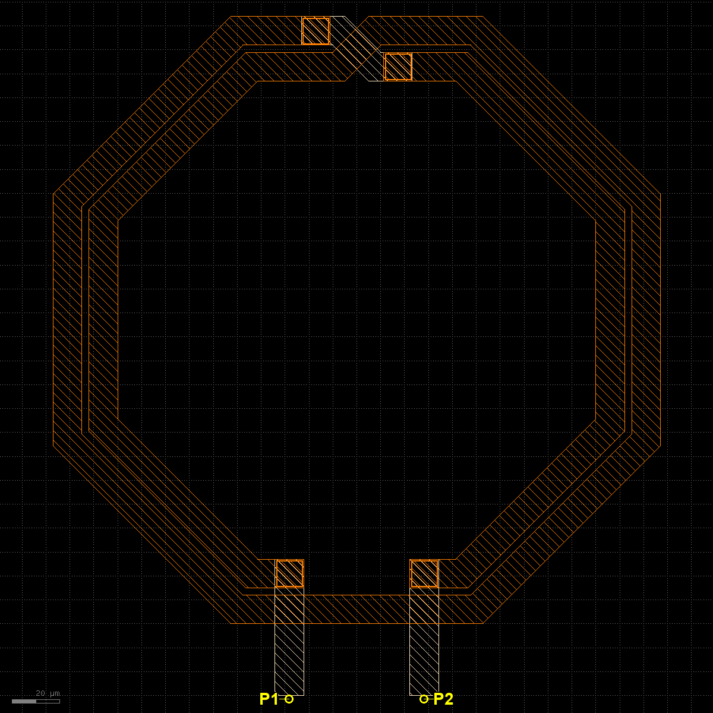
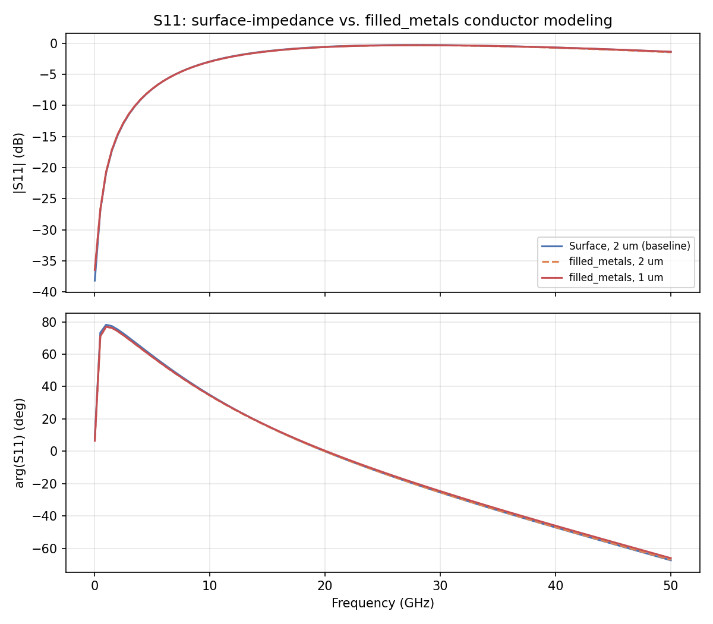
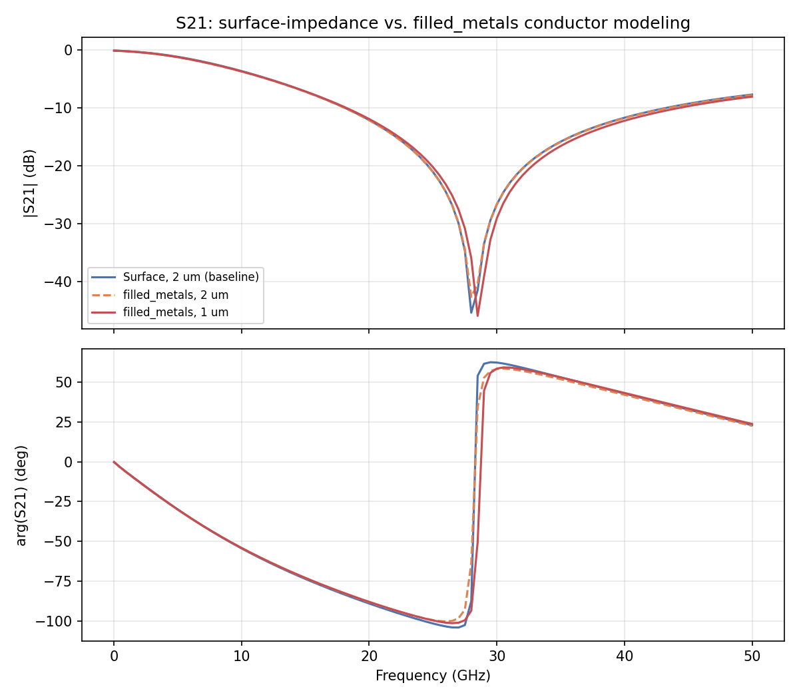
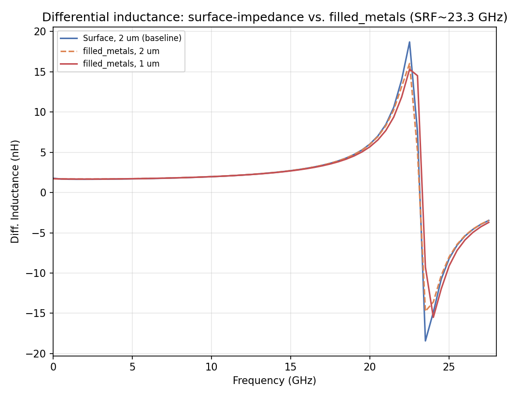
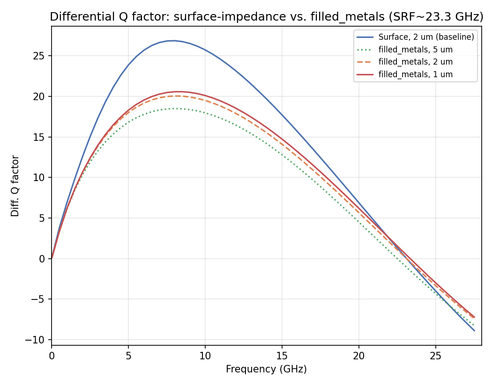
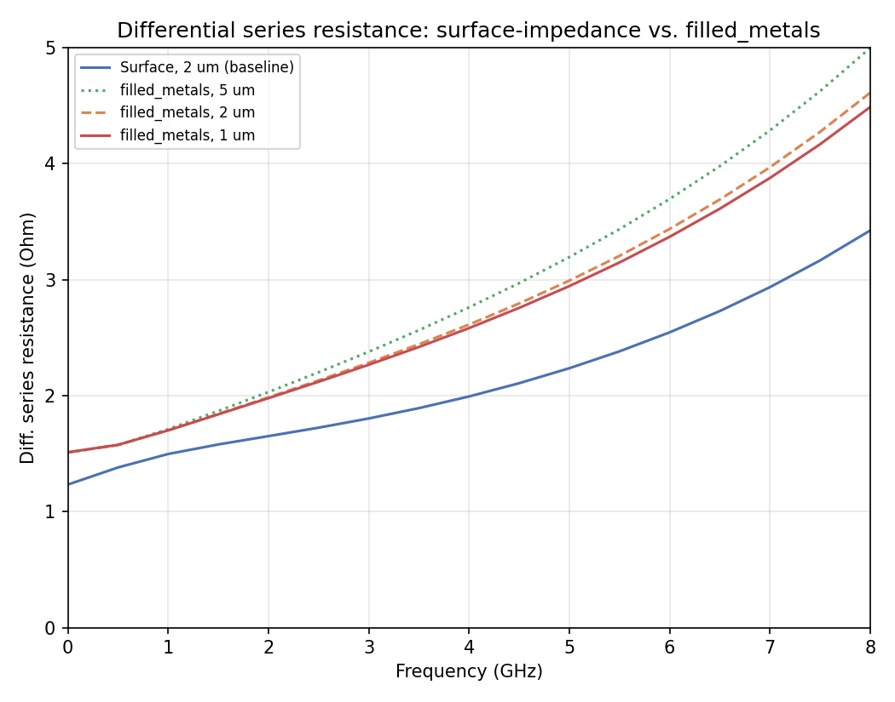
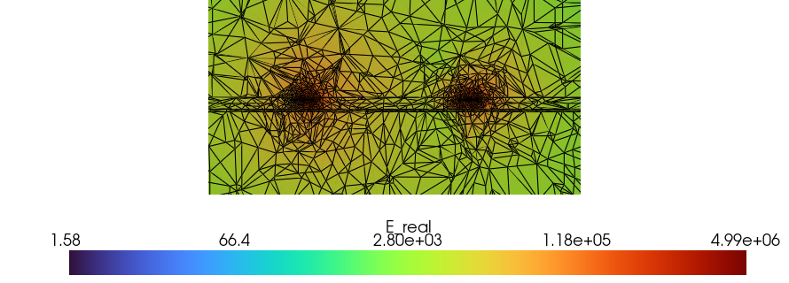
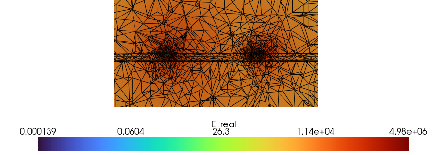
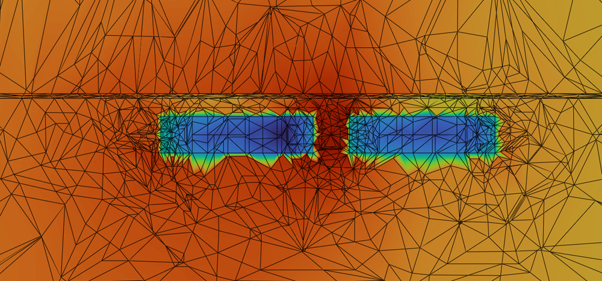

# Conductor Modeling Comparison: L_2n0 Octagonal Inductor (surface-impedance vs. filled_metals)

- **Model:** `L_2n0_twoport.gds`, stackup `SG13G2_200um.xml`
- **Solver:** AWS Palace (FEM), ABC boundaries, 150 µm margin, 50 µm air-around, order 2
- **Sweep:** 0–50 GHz (auto-shifted to 0.01 GHz start), 0.5 GHz step, field dump at 15 GHz
- **Ports:** 2 via ports (SUBGND→TopMetal1), Z0 = 50 Ω, evaluated as a differential pair
  (`Zdiff = Z11-Z12-Z21+Z22`, plain engineering convention — same method as
  `more_examples/mesh_convergence/mesh_convergence_inductor/results/plot_inductor_convergence.py`)
- **Design/eval frequency:** 7 GHz (specified)
- **S-parameters used throughout:** raw (not de-embedded) — the direct simulated quantity at
  the physical port terminals; de-embedding would subtract out port inductance and distort the
  reported L

## 0. Purpose

This is not a mesh-convergence study in the usual sense (see
`more_examples/mesh_convergence/AGENTS.md` for that house style) — it compares the new
`settings['filled_metals']` conductor model (conductors as solid bulk-conductivity volumes)
against the existing default (thin surface-impedance sheets) on a real, previously-designed
inductor, at both a matched mesh size (2 µm) and a finer one (1 µm) for `filled_metals`. The
three model variants and their raw simulation results already existed (`filled_metal_L2n0/` in
`test_data/`, generated and solved by the user); this report moves them into `more_examples/`
and analyzes the results.

## 1. Layout



Measured directly from the GDS (KLayout batch mode): a single-turn octagonal coil on
**TopMetal2** (layer 134, 3 µm thick, σ = 30.3×10⁶ S/m), ~254×254 µm bounding box (X ±127 µm,
Y 30–284 µm), ~12 µm trace width, ~3 µm minimum internal gap (at the top-side underpass bridge,
connected through two **TopVia2** crossings, layer 133). The coil's two ends drop down through
short **TopMetal1** (layer 126, 2 µm thick, σ = 27.8×10⁶ S/m) leads to the two via ports (P1,
P2), which connect down to **SUBGND**, 12 µm wide, spaced 56.4 µm center-to-center (X = ∓28.2
µm). Overall drawn footprint (including the ground return under the ports) is ~298×298 µm.

## 2. Method

Three model variants, same GDS/stackup/ports/sweep/boundaries — only conductor model and mesh
size differ:

| Variant | Conductor model | `refined_cellsize` | Model file |
|---|---|---:|---|
| `surface_2um` | Surface impedance (default) | 2 µm | `palace_L2n0_surface_2.py` |
| `volume_2um` | `filled_metals` (bulk-conductivity volume) | 2 µm | `palace_L2n0_volume_2.py` |
| `volume_1um` | `filled_metals` (bulk-conductivity volume) | 1 µm | `palace_L2n0_volume_1.py` |

`surface_2um` vs. `volume_2um` isolates the effect of conductor modeling alone (identical
mesh size). `volume_2um` vs. `volume_1um` isolates the effect of mesh refinement alone within
`filled_metals` (identical conductor model). `surface_2um` vs. `volume_1um` is the combined
effect (baseline vs. `filled_metals` as actually used for this design).

## 3. Simulation cost

| Variant | DOF | Mesh elements | Solve time | Peak RAM |
|---|---:|---:|---:|---:|
| `surface_2um` | 629,856 | 90,655 | 6m 55s | 7.80 GB |
| `volume_2um` | 751,332 | 118,303 | 11m 54s | 10.63 GB |
| `volume_1um` | 1,616,260 | 254,592 | 26m 0s | 23.59 GB |

At matched 2 µm mesh, `filled_metals` costs ~19% more DOF and ~72% more solve time than the
surface-impedance model — the conductor interior is now meshed and solved as real FEM unknowns
instead of a boundary condition. Refining `filled_metals` from 2 µm to 1 µm more than doubles
DOF again (2.15×) and roughly doubles solve time and RAM, consistent with the known cost of the
current implementation, which has no automatic near-surface mesh grading (see
`doc/ARCHITECTURE.md`'s `filled_metals` entry) — the whole conductor volume gets uniformly
refined, not just the region near skin depth.

## 4. S-parameters

Plain 2-port network (S12 = S21 by reciprocity, not shown separately).




### Delta-S table

Max|ΔS| is the linear complex-magnitude difference over the full swept band; dB columns are
magnitude-only differences at representative frequencies (full table:
`results/delta_S_table.csv`).

| Param | Comparison | What changes | Max\|ΔS\| (linear) | \|ΔS\|@1GHz (dB) | \|ΔS\|@7GHz (dB) | \|ΔS\|@20GHz (dB) |
|---|---|---|---:|---:|---:|---:|
| S11 | surface_2um → volume_2um | conductor modeling only | 0.0077 | 0.1617 | 0.0137 | 0.0340 |
| S11 | volume_2um → volume_1um | mesh refinement only | 0.0165 | 0.0102 | 0.0027 | 0.0080 |
| S11 | surface_2um → volume_1um | combined | 0.0195 | 0.1719 | 0.0110 | 0.0420 |
| S21 | surface_2um → volume_2um | conductor modeling only | 0.0068 | 0.0188 | 0.0739 | 0.0427 |
| S21 | volume_2um → volume_1um | mesh refinement only | 0.0149 | 0.0003 | 0.0062 | 0.2207 |
| S21 | surface_2um → volume_1um | combined | 0.0178 | 0.0184 | 0.0677 | 0.1780 |

At 7 GHz, the conductor-modeling effect (surface → volume) dominates S21's delta over the
mesh-refinement effect (volume_2um → volume_1um) by more than 10×, while `volume_2um` and
`volume_1um` agree closely with each other — the `filled_metals` result is itself already
reasonably mesh-converged at 7 GHz; the bigger factor is the conductor model, not mesh size.

## 5. Differential L / Q / Rseries





Self-resonant frequency (Ldiff crossing zero) is ~23.1–23.3 GHz for all three variants —
consistent across conductor models and mesh sizes, a good cross-check of the extraction itself.
L and Q are plotted out to 1.2×SRF; the 20 GHz table row sits close enough to resonance that
L/Q swing quickly there and shouldn't be read as "the" inductance in the same sense as the
1/7 GHz rows. Rseries is instead plotted only to 8 GHz (y-axis capped at 5 Ω) to keep the
low-frequency divergence between conductor models visible — the same data zoomed out to SRF
would be dominated by the >100 Ω climb near resonance (see the 20 GHz table row).

| Freq (GHz) | Variant | L (nH) | Q | Rseries (Ω) |
|---:|---|---:|---:|---:|
| 1.0 | Surface, 2 µm (baseline) | 1.6521 | 6.93 | 1.497 |
| 1.0 | filled_metals, 2 µm | 1.6798 | 6.20 | 1.701 |
| 1.0 | filled_metals, 1 µm | 1.6808 | 6.21 | 1.701 |
| **7.0** | **Surface, 2 µm (baseline)** | **1.7763** | **26.62** | **2.935** |
| **7.0** | **filled_metals, 2 µm** | **1.7874** | **19.81** | **3.968** |
| **7.0** | **filled_metals, 1 µm** | **1.7859** | **20.27** | **3.876** |
| 20.0 (near SRF) | Surface, 2 µm (baseline) | 6.03 | 6.86 | 110.5 |
| 20.0 (near SRF) | filled_metals, 2 µm | 5.98 | 5.63 | 133.5 |
| 20.0 (near SRF) | filled_metals, 1 µm | 5.69 | 6.18 | 115.7 |

At the 7 GHz design frequency: **L agrees closely** across all three (1.776–1.787 nH, <0.7%
spread) — the inductance itself is insensitive to conductor model here. **Q and Rseries do not**:
`filled_metals` shows ~30–35% higher Rseries and ~24–26% lower Q than the surface-impedance
model, essentially independent of mesh (volume_2um and volume_1um agree with each other to
~2.5% on both, at 1 µm and 2 µm mesh) — this is a real, mesh-converged difference between the
two *models*, not a `filled_metals` mesh-resolution artifact at this frequency.

**Why might this be:** the zoomed Rseries plot (0–8 GHz, 0–5 Ω) shows the gap between models is
already present near DC (~1.2 Ω surface vs. ~1.5 Ω `filled_metals` as f→0) and grows roughly
linearly out to 8 GHz — a frequency-*independent* offset plus a frequency-*dependent* one, not a
single skin-effect story. This is due to the over-estimated total cross section in the sheet model 
with all 4 sides width multiplied by half the metal layer thickness - a genuine difference in effective
conductor cross-section between a meshed volume and an analytic surface-impedance sheet. The
frequency-dependent growth on top of that is consistent with skin/proximity effect: in
TopMetal2 (σ=30.3×10⁶ S/m), skin depth is 2.89 µm at 1 GHz and 1.09 µm at 7 GHz against a 3 µm
metal thickness — thin enough to matter, but not so thin that either 1 µm or 2 µm mesh should
badly under-resolve it. This is a tightly-wound coil with a
~3 µm gap at the underpass bridge and conductor sections running close to each other and to the
SUBGND return — a surface-impedance boundary condition computes loss from the local field at
each point, independent of nearby conductors, whereas a volume-meshed model can in principle
resolve proximity-effect current crowding between adjacent conductor sections that a local BC
can't capture. Both of these are plausible contributors, not proven ones — it would take an
independent check (e.g. an even finer mesh, or
comparison against another tool) to confirm which model is closer to physical reality here rather
than just noting they disagree.

## 6. E-field and mesh: surface vs. volume conductors

Cutting plane Y=150 µm, view along -Y, mesh overlay enabled, zoomed to the conductor
cross-sections cut by the plane (two coil cross-sections at 15 GHz field-dump frequency, `E_real`
log scale).



*Surface (2 µm):* the conductor is a boundary, not a volume — mesh only refines near its edges.



*filled_metals (2 µm):* the conductor is now a real meshed solid, but coarsely.



*filled_metals (1 µm):* visibly denser mesh both inside the conductor and in the surrounding
dielectric near it, compared to the 2 µm case.

## 7. Discussion

- **Inductance (L)** is robust to conductor modeling choice for this structure at 7 GHz — use
  either model if L alone is the target quantity.
- **Q and series resistance are not** — `filled_metals` predicts meaningfully more loss than the
  surface-impedance default here, and this shows up consistently at both tested mesh sizes, so
  it isn't simply a "refine the mesh more" fix. Anyone using `filled_metals` for loss/Q-sensitive
  work should be aware the two conductor models can disagree by tens of percent on Q/R even when
  well mesh-converged against themselves, and that this repo doesn't yet have independent
  validation (e.g. against measurement) of which one is closer to reality for a coupled-turn
  structure like this.
- **Cost**: `filled_metals` at matched mesh already costs ~70% more solve time than surface
  impedance; refining further roughly doubles cost again. For routine differential-L extraction
  where surface and volume models agree, the surface-impedance default remains the practical
  choice; `filled_metals` is worth its extra cost specifically when the bulk-conductor physics
  (that a boundary condition can't represent) is the thing being investigated.

## 8. Where everything lives

```
more_examples/filled_metals_inductor_L2n0/
├── filled_metals_comparison_report.md   -- this file
├── L_2n0_twoport.gds                    -- layout (input)
├── SG13G2_200um.xml                     -- stackup (input)
├── palace_L2n0_surface_2.py             -- surface-impedance, 2um mesh
├── palace_L2n0_volume_2.py              -- filled_metals, 2um mesh
├── palace_L2n0_volume_1.py              -- filled_metals, 1um mesh
├── palace_model/                        -- raw solver output (gitignored, not committed)
└── results/
    ├── analyze_comparison.py            -- regenerates every plot/table below
    ├── delta_S_table.csv
    ├── delta_LQR_table.csv
    ├── snp/                             -- archived raw (not de-embedded) Touchstone files
    └── plots/
        ├── layout_labeled.png
        ├── s11_comparison.png, s21_comparison.png
        ├── inductor_LQR_l.png, _q.png, _r.png
        └── efield_mesh_palace_L2n0_{surface_2,volume_2,volume_1}.png
```

Regenerate all tables/plots (except the layout screenshot and E-field renders, which need
KLayout and `field_viewer.py` respectively) with:
```
cd results && python analyze_comparison.py
```
