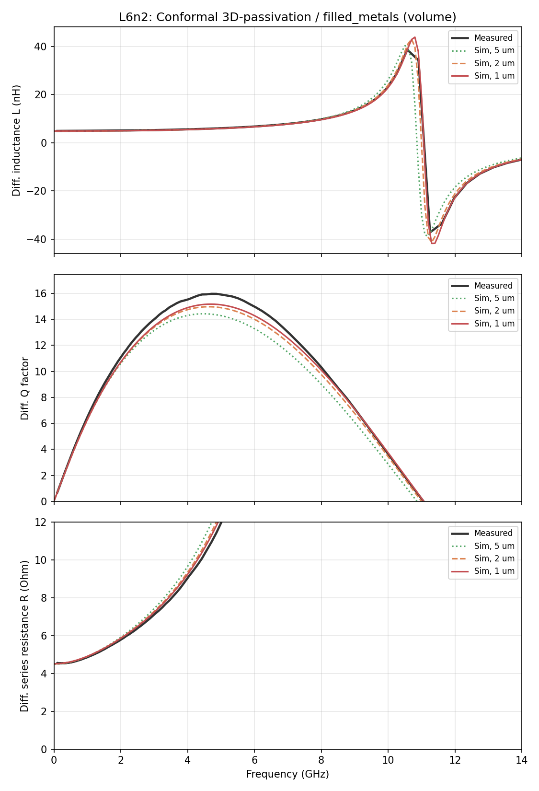
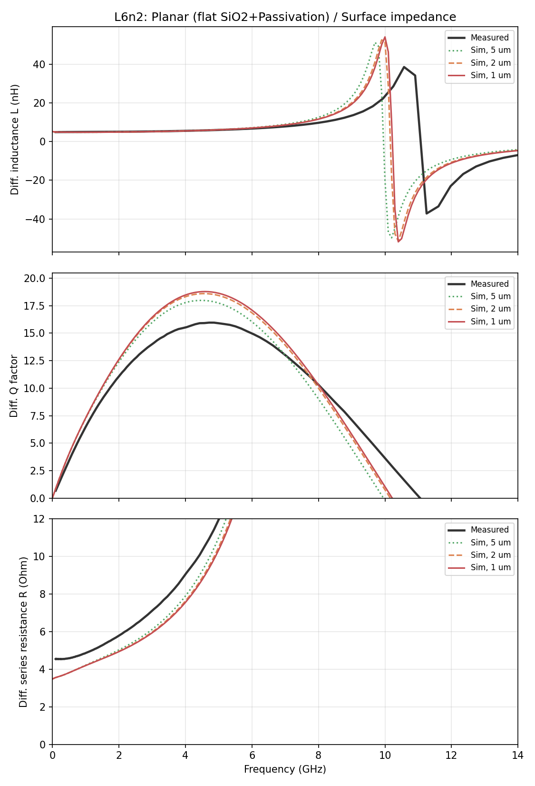
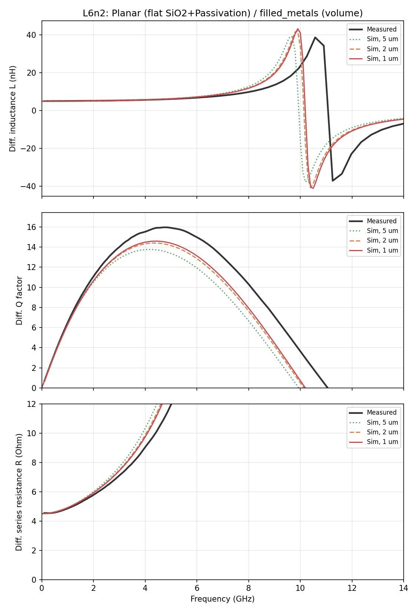
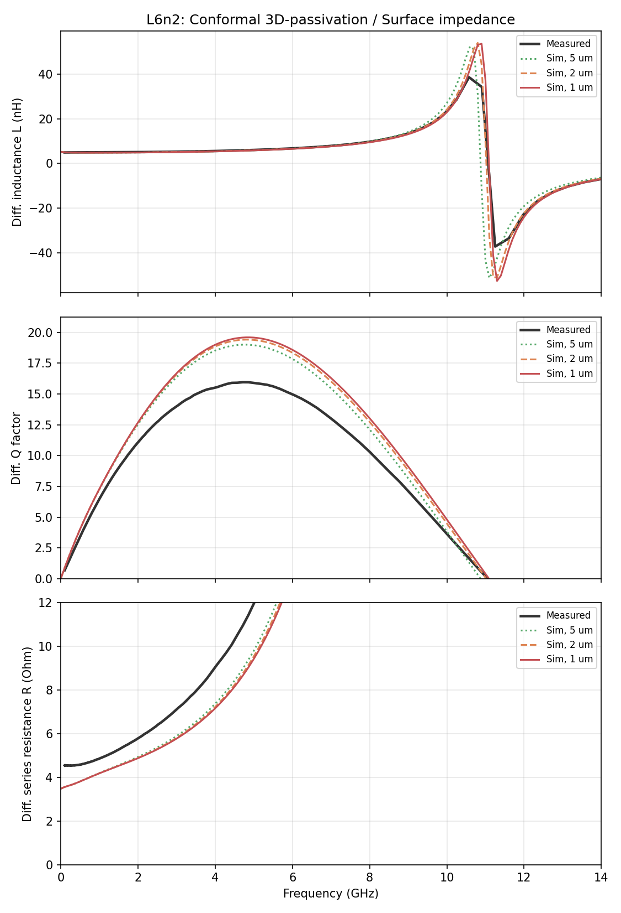
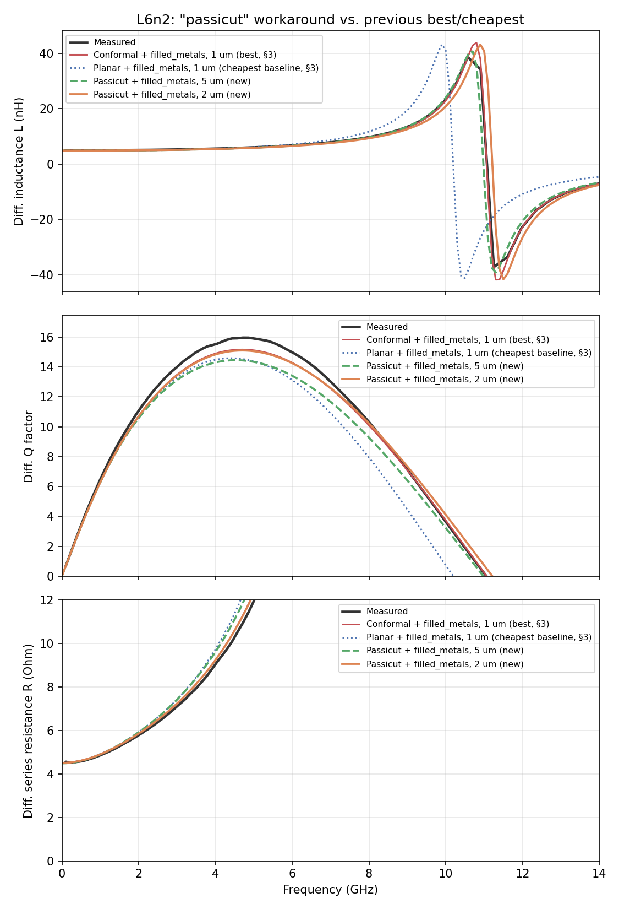

# Stackup x Conductor-Model Study: L6n2 Inductor vs. Measurement (IHP SG13G2)

- **Model:** `L6n2_with_ports.gds` (cell `L_6n2`), 2 via ports (Metal1 → TopMetal1, Z0 = 50 Ω)
- **Solver:** AWS Palace (FEM), order 2, ABC boundaries, 100 µm margin + 50 µm air-around
- **Sweep:** 0–14 GHz, 0.1 GHz step, Palace's PROM-based adaptive frequency sweep — capped at 14 GHz (~1.2x the measured self-resonant frequency, see below), de-embedded S-parameters throughout (port parasitic inductance removed)
- **Measurement reference:** `meas_L5_6n2_THRU_deemb.S2P` (already de-embedded, 100 MHz–50 GHz) — measured differential SRF ≈ **11.07 GHz**
- **Execution:** remote solve on `hpz2` (Spack-built Palace, `mpirun -n 16` of 32 cores, 109 GB RAM), 12 jobs run sequentially

## 0. Layout


A 4-turn octagonal spiral inductor wound on TopMetal2, ~257×352 µm bounding box. Turn-to-turn crossovers route down to TopMetal1 through TopVia2 via arrays (128 vias total across the crossings, not single vias — standard IHP practice for current-carrying crossings). Both leads (`L_A`/`L_B` in the GDS) drop to via ports **P1**/**P2** at the bottom, landing on a wider ground-reference pad region.

## 1. Method

Full 2 (stackup) × 2 (conductor model) × 3 (mesh) matrix, 12 runs total, all other settings held fixed:

| Axis | Values |
|---|---|
| Stackup | `SG13G2_200um.xml` ("planar" — TopMetal2 under a flat SiO2+Passivation layer) vs. `SG13G2_200um_3D_passivation.xml` ("conformal" — passivation conforms to the metal step) |
| Conductor model | Surface impedance (default, hollow) vs. `filled_metals=True` (solid bulk-conductivity volume, HFSS "solve inside" equivalent) |
| Mesh | `refined_cellsize` = 5, 2, 1 µm |

Model files: `palace_L6n2_<stackup>_<model>_<mesh>um.py` (12 total). Differential quantities use `Zdiff = Z11-Z12-Z21+Z22` (plain engineering convention, same as `filled_metals_inductor_L2n0/results/analyze_comparison.py` and `mesh_convergence_inductor/results/plot_inductor_convergence.py`), then `Ldiff = Im(Zdiff)/ω`, `Qdiff = Im(Zdiff)/Re(Zdiff)`.

## 2. Simulation cost

| Stackup | Conductor model | Mesh | DOF | Mesh elements | Solve time | Peak RAM |
|---|---|---:|---:|---:|---:|---:|
| Planar | Surface | 5 µm | 332,044 | 47,959 | 8m 26s | 5.57 GB |
| Planar | Surface | 2 µm | 949,350 | 135,689 | 21m 1s | 13.88 GB |
| Planar | Surface | 1 µm | 1,888,810 | 266,551 | 36m 9s | 28.27 GB |
| Planar | filled_metals | 5 µm | 391,354 | 61,697 | 7m 42s | 6.54 GB |
| Planar | filled_metals | 2 µm | 1,147,416 | 180,848 | 19m 5s | 17.77 GB |
| Planar | filled_metals | 1 µm | 2,410,314 | 379,819 | 45m 40s | 35.86 GB |
| Conformal | Surface | 5 µm | 497,856 | 74,189 | 14m 45s | 7.74 GB |
| Conformal | Surface | 2 µm | 1,231,934 | 180,416 | 27m 24s | 17.78 GB |
| Conformal | Surface | 1 µm | 2,339,478 | 337,898 | 1h 3m 26s | 34.96 GB |
| Conformal | filled_metals | 5 µm | 557,146 | 87,924 | 17m 35s | 8.29 GB |
| Conformal | filled_metals | 2 µm | 1,429,384 | 225,477 | 31m 40s | 20.89 GB |
| Conformal | filled_metals | 1 µm | 2,861,190 | 451,199 | **1h 5m 44s** | **42.09 GB** |

The conformal stackup costs more than planar at every matched mesh/model point (extra geometry from the side SiO2 refinement blocks near TopMetal2 — same effect seen in the earlier `conformal_3D_passivation` balun study), and `filled_metals` costs more than surface impedance at matched mesh/stackup (conductor interior now meshed as real FEM unknowns). The most expensive corner (conformal + filled_metals + 1 µm) is ~4x the cost of the cheapest (planar + surface + 5 µm) on every metric.

Full table: [`results/cost_table.csv`](results/cost_table.csv).

## 3. Differential L / Q / R vs. measurement

One 3-panel plot (L, Q, series R top to bottom) per stackup × conductor-model combination, each overlaying all 3 mesh sizes against the measured curve. L and Q span the full 0–14 GHz sweep; R shares that x-range but its y-axis is clipped to 0–12 Ω to keep the low-frequency loss values legible instead of being dwarfed by the hundreds-of-Ω swing right at/after the ~11 GHz SRF. Conformal + filled_metals (the best-matching combination, see below) first:






**Mesh sensitivity is small everywhere** — the 5/2/1 µm curves sit nearly on top of each other in all four plots; the differences that matter are between combinations, not between mesh sizes within one.

**Stackup dominates the self-resonant frequency.** The planar stackup's simulated SRF sits at ~10.2 GHz regardless of mesh or conductor model — visibly below the measured 11.07 GHz. The conformal stackup's SRF lands right on top of the measured one (~11.0–11.1 GHz) in both the surface and filled_metals plots. This is the same finding as the `conformal_3D_passivation` balun study: getting the passivation topography right shifts the resonant behavior by an amount mesh refinement can't fix.

**Conductor model controls the Q level (and, equivalently, R) independent of stackup.** In this frequency range, surface impedance consistently *overestimates* Q / *underestimates* R vs. measurement — visible both as the sim Q curves sitting above the measured one, and the sim R curves sitting below it, in both surface-impedance plots. `filled_metals` pulls both toward (planar) or onto (conformal) the measured curves.

**IMPORTANT NOTE: The "solve inside" filled metals choice requires to mesh into skin effect, which gets harder at higher frequencies where skin depth decreases much below 1 µm. Do not misunderstand this example - it applies to this frequency range shown here.**  

**Best combined match: conformal stackup + filled_metals.** In that plot, both L (across the whole band, through resonance) and Q (peak value and shape) track the measured curve closely — visibly the tightest agreement of the four combinations.

## 4. Accuracy vs. measurement (finest mesh, 1 µm)

At 1/5/9 GHz (all below the measured 11.07 GHz SRF, to avoid the meaningless dB blow-up right at resonance):

| Stackup | Conductor model | Freq | L (nH) | L meas (nH) | L err | Q | Q meas | Q err |
|---|---|---:|---:|---:|---:|---:|---:|---:|
| Planar | Surface | 1 GHz | 4.86 | 5.01 | -2.9% | 7.29 | 6.46 | +12.9% |
| Planar | Surface | 5 GHz | 6.14 | 6.06 | +1.2% | 18.63 | 15.89 | +17.2% |
| Planar | Surface | 9 GHz | 19.39 | 13.75 | **+41.0%** | 5.80 | 6.93 | -16.4% |
| Planar | filled_metals | 1 GHz | 4.91 | 5.01 | -1.9% | 6.27 | 6.46 | -2.9% |
| Planar | filled_metals | 5 GHz | 6.20 | 6.06 | +2.3% | 14.37 | 15.89 | -9.6% |
| Planar | filled_metals | 9 GHz | 19.52 | 13.75 | **+41.9%** | 4.46 | 6.93 | -35.7% |
| Conformal | Surface | 1 GHz | 4.86 | 5.01 | -3.0% | 7.29 | 6.46 | +13.0% |
| Conformal | Surface | 5 GHz | 5.88 | 6.06 | -3.1% | 19.58 | 15.89 | +23.2% |
| Conformal | Surface | 9 GHz | 13.12 | 13.75 | -4.6% | 9.10 | 6.93 | +31.3% |
| Conformal | filled_metals | 1 GHz | 4.91 | 5.01 | -2.1% | 6.28 | 6.46 | -2.7% |
| Conformal | filled_metals | 5 GHz | 5.94 | 6.06 | -2.1% | 15.11 | 15.89 | -4.9% |
| Conformal | filled_metals | 9 GHz | 13.23 | 13.75 | -3.8% | 7.08 | 6.93 | +2.2% |

**Average |error| across these 3 points, finest mesh:**

| Combination | avg\|L err\| | avg\|Q err\| |
|---|---:|---:|
| Planar / Surface | 15.0% | 15.5% |
| Planar / filled_metals | 15.4% | 16.1% |
| Conformal / Surface | 3.6% | 22.5% |
| **Conformal / filled_metals** | **2.6%** | **3.3%** |

Both planar rows are dominated by the 9 GHz point (+41%), a direct consequence of the planar stackup's SRF sitting below 9 GHz's neighborhood while the real device's SRF hasn't been reached yet — not a mesh or conductor-model artifact. Conformal/Surface fixes L (3.6%) but leaves Q badly overestimated (22.5%, sim underestimates loss). Conformal/filled_metals is the only combination accurate on **both** L and Q, by a wide margin.

Full table (all 3 mesh points): [`results/accuracy_vs_measured_table.csv`](results/accuracy_vs_measured_table.csv).

## 5. Conclusion

- **Stackup choice, not mesh refinement, fixes the resonant-frequency error.** Planar's SRF is ~0.9 GHz low regardless of mesh (5→1 µm barely moves it) or conductor model; switching to the conformal stackup alone closes that gap, matching the same conclusion as the `conformal_3D_passivation` balun study.
- **Conductor model choice, not mesh refinement, fixes the Q-level error.** For this testcase, surface impedance overestimates Q by 13–31% vs. measurement across both stackups; `filled_metals` corrects this, most completely when paired with the conformal stackup (Q error down to 2–5% at 1/5 GHz, only 2.2% even at 9 GHz).
- **Recommendation: conformal stackup + `filled_metals`, at 2 µm.** It's the only combination accurate for this example and frequency range on both L and Q (2.6%/3.3% avg error at finest mesh), and mesh sensitivity is small enough that 2 µm (31m 40s, 20.89 GB) already tracks the 1 µm result (1h 5m 44s, 42.09 GB) closely — going finer than 2 µm buys little here. Against the cheapest corner (planar/surface/5µm: 8m 26s, 5.57 GB), that's roughly **4x the runtime and RAM for a combination that's actually validated against measurement**, rather than one that's merely cheap.
- **If only one axis can be changed:** stackup accuracy (SRF) matters more for L, conductor-model accuracy (loss) matters more for Q — but conformal+filled_metals is needed to fix both at once; conformal+surface alone still leaves Q off by >20%.

**IMPORTANT NOTE: The "solve inside" filled metals choice requires to mesh into skin effect, which gets harder at higher frequencies where skin depth decreases much below 1 µm. Do not misunderstand this example - it applies to this frequency range shown here.**  

## 6. "Passicut" workaround: cheap approximation of the conformal stackup

§3–5 found that the conformal-passivation stackup is what fixes the SRF match, but its explicit 3D sidewall geometry (`SiO2_above`/`SiO2_sides` derived layers, oversize+NOT boolean around TopMetal2) is the most expensive corner of the whole study (2.86M DOF, 1h 5m 44s, 42.09 GB at 1 µm). Since mesh refinement itself wasn't the limiting factor for *this* inductor's geometry (5.5 µm gap, 8 µm trace — coarse enough that 5 µm cells still resolve it), a cheaper workaround was tried instead: **`SG13G2_200um_passicut.xml`**.

Rather than deriving separate 3D sidewall/cap geometry, this stackup just shortens the SiO2 dielectric block by TopMetal2's own thickness using reference-relative positioning (`Thickness="=15.7303-3"`) so AIR (with a thin 0.4 µm Passivation liner in the "valleys" between traces) takes over beside and above the metal, instead of solid SiO2 fully embedding it as in the plain planar stackup. No derived-layer booleans, no extra mesh-refinement geometry — SiO2 simply stops partway up TopMetal2's sides instead of wrapping it. `filled_metals` was kept (§3–5 showed conductor model, not stackup, controls the Q/R match), and only 5/2 µm mesh was tried (no 1 µm — unnecessary per the point above).

### Cost

| Variant | Mesh | DOF | Mesh elements | Solve time | Peak RAM |
|---|---:|---:|---:|---:|---:|
| Passicut + filled_metals | 5 µm | 397,486 | 62,619 | 9m 18s | 6.39 GB |
| Passicut + filled_metals | 2 µm | 1,445,386 | 227,705 | 26m 55s | 21.86 GB |
| *(for reference)* Conformal + filled_metals | 1 µm | 2,861,190 | 451,199 | 1h 5m 44s | 42.09 GB |
| *(for reference)* Planar + filled_metals | 1 µm | 2,410,314 | 379,819 | 45m 40s | 35.86 GB |

Passicut at 5 µm is **~7x faster and ~6.6x less RAM** than the conformal 1 µm result it's compared against below — even cheaper than the plain planar stackup at any mesh in §2.

### Accuracy vs. measurement



The passicut curves (5 µm and 2 µm) sit almost on top of the expensive conformal 1 µm curve across L, Q, and R — and clearly separated from the planar baseline's SRF mismatch:

| Variant | avg\|L err\| | avg\|Q err\| |
|---|---:|---:|
| Conformal + filled_metals, 1 µm *(reference, §3–4)* | 2.6% | 3.3% |
| Planar + filled_metals, 1 µm *(reference, §3–4)* | 15.4% | 16.1% |
| **Passicut + filled_metals, 5 µm** | **2.0%** | **6.8%** |
| **Passicut + filled_metals, 2 µm** | **4.3%** | **4.6%** |

Passicut's L accuracy at 5 µm (2.0%) is even slightly better than the expensive conformal 1 µm result; its Q accuracy (6.8%) is between conformal and planar but still far closer to conformal than to planar. Passicut at 2 µm brings Q accuracy to 4.6%, essentially matching conformal's 3.3%.

Full table: [`results/passicut_accuracy_table.csv`](results/passicut_accuracy_table.csv), [`results/passicut_cost_table.csv`](results/passicut_cost_table.csv).

**This workaround gets most of the conformal stackup's accuracy benefit at a small fraction of its cost** — a 1D reference-relative stackup edit standing in for expensive derived 3D sidewall geometry. For routine use on inductor geometries where mesh isn't the limiting factor (as established here), passicut + filled_metals at 5 µm is the practical recommendation over the full conformal treatment.

## 7. Where everything lives

The §6 passicut runs' *source* files (model scripts, `SG13G2_200um_passicut.xml`, mesh/config, raw solver output) live in a separate location, `test_data/filled_metals_inductor_L6n2/` (not under this study's own directory) — only their de-embedded results and derived plots/tables were copied in here:

```
test_data/filled_metals_inductor_L6n2/
├── L6n2_with_ports.gds                          # same layout as the main study
├── SG13G2_200um_passicut.xml                     # §6 passicut stackup (input)
├── palace_L6n2_passicut_volume_5um.py, _2um.py   # §6 model scripts
└── palace_model/                                 # §6 raw solver output (not committed)

more_examples/filled_metals_option/filled_metals_inductor_L6n2/
├── README.md                                    # this report
├── L6n2_with_ports.gds                          # layout (input)
├── SG13G2_200um.xml                              # planar stackup (input)
├── SG13G2_200um_3D_passivation.xml               # conformal stackup (input)
├── meas_L5_6n2_THRU_deemb.S2P                    # measurement reference (input)
├── palace_L6n2_<stackup>_<model>_<mesh>um.py     # 12 model scripts (§1-5)
├── palace_model/                                 # raw solver output (mesh/config/paraview, not committed)
└── results/
    ├── analyze_comparison.py                     # regenerates every §1-5 plot/table
    ├── analyze_passicut.py                        # regenerates §6's plot/tables (reads test_data/.../palace_model/ + results/snp/)
    ├── cost_table.csv                            # §2
    ├── passicut_cost_table.csv                    # §6
    ├── passicut_accuracy_table.csv                # §6
    ├── accuracy_vs_measured_table.csv             # §4, all 3 mesh points
    ├── snp/                                      # de-embedded Touchstone files, one per combination x mesh, + measured.s2p + passicut_volume_{5,2}um.s2p
    └── plots/
          layout_labeled.png                       # §0
          LQR_conformal_volume.png, LQR_planar_surface.png
          LQR_planar_volume.png, LQR_conformal_surface.png
          LQR_passicut_comparison.png               # §6
```

Regenerate §1-5's tables/plots with `python results/analyze_comparison.py`, and §6's with `python results/analyze_passicut.py` (from `d:\venv\palace`), any time the archived `.snp` files change or the §6 source data under `test_data/filled_metals_inductor_L6n2/` is re-run — `analyze_comparison.py` re-derives its cost table from `palace_model/` via `scripts/palace_summary.py` and its L/Q/accuracy tables from `results/snp/`; `analyze_passicut.py` does the same but reads `test_data/.../palace_model/` for cost and reuses `conformal_volume_1um.s2p`/`planar_volume_1um.s2p` already in `results/snp/` as its reference points.
